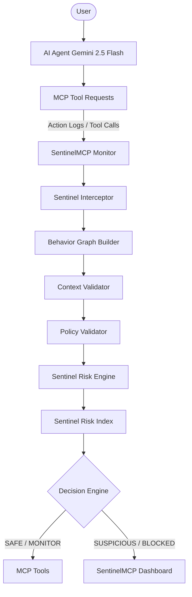

# SentinelMCP: Runtime Behavioral Security and Policy Enforcement Framework for MCP Agent Systems

> **"CrowdStrike for AI Agents"** — SentinelMCP is a runtime behavioral verification framework that continuously monitors whether an MCP agent's tool execution remains aligned with the user's intent using an empirically learned, decomposable **Sentinel Risk Index (SRI)**.

## Architecture Diagram



## Setup Instructions

This project requires **Python 3.10+**.

```bash
# Create a virtual environment
python -m venv venv

# Activate the virtual environment
# On Windows:
venv\Scripts\activate
# On Unix or MacOS:
# source venv/bin/activate

# Install dependencies
pip install -r requirements.txt
```

## Project Layout Overview

```
.
├── .env.example          # Example environment variables
├── .gitignore            # Git ignore rules
├── ETHICS.md             # Ethical guidelines and data policies
├── README.md             # Project overview (this file)
├── requirements.txt      # Python dependencies
└── data/                 # Datasets
    └── attacks/
        └── set_a/        # Synthetic attack data (ignored except .gitkeep)
```

## Target Success Criteria

- F1 >= 0.80 on Set B, CI not crossing Policy-Only baseline.

## Compute Check Note

- Evaluation runs in < 15 mins on CPU.
